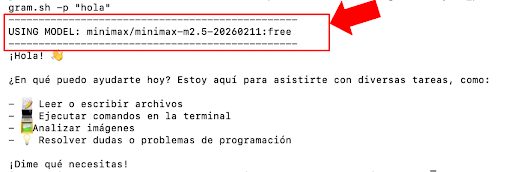

# OPENROUTER FREE CLI AGENT
---
A Python-based CLI agent for openrouter/free (dynamic in-runtime selection of free AI models). This agent features built-in tool support for processing local images as input (via base64-enconded strings), reading/writing files, and executing bash commands.

## 🧱TECHNOLOGIES
---
*	OpenRouter API
*	Multimodal input tools
*	Python
*	Shell

## ✨FEATURES
---
*	Free multimodel AI Agent based on openrouter/free 
*	Read/Write tool for AI model to interact with local text files
*	Image read tool for AI model to receive image input
*	Bash command tool for AI model to execute shell commands

## 🗺️THE PROCESS
---
This repository started as a CodeCrafters challenge for a Claude-specific Agent which I ended up expanding to: a) run on completely free AI models for the long run, and b) accept image input (both features not included in the original CodeCrafters challenge at the time this repository was published). To avoid model deprecation issues by picking any specific free model (a usual occurrence for free models) this Agent was built for openrouter/free, an implementation by OpenRouter that “routes” requests to available free models, so long run support will be on OpenRouter.

Note: If you want to take on the original CodeCrafters challenge, head over to codecrafters.io, honestly all their challenges are super cool. 🦆

## 🚀RUNNING THE PROJECT
---
1. Add your OpenRouter API key as an environment variable named “OPENROUTER_API_KEY". Just in case you need it, here is a cool tutorial on how to get your OpenRouter API key -> https://www.youtube.com/watch?v=ZELx_OzYAQo&loop=0
2. Open a terminal inside the project folder and
    2. Run command pip install -e .
    2. Call the agent with command openrouter-free-cli-agent -p followed by your request in quotation marks. A couple examples:

openrouter-free-cli-agent -p “What is the capital of Venezuela?”
openrouter-free-cli-agent -p “What is inside ~/Downloads/leeme.txt”
openrouter-free-cli-agent -p “What does this image show ~/Downloads/image.jpeg”

If this approach proves unsuccessful, it may be due to issues with dependency versions. Try the following command instead:

./your_program.sh -p "[introduce your prompt here]"

This should fix dependency version incompatibilities.

## 💡CHALLENGES & LEARNINGS
---
This is a cool project to learn firsthand how models process requests and how they structure their responses in a list of choices with their respective attributes and metadata. Tool call looping was also a great lesson and an interesting challenge: openrouter/free picks up a model every time it’s called during the request loop, and it doesn’t always find an available model that supports tools (availability depends on a variety of factors such as model demand); I left a current-model-log active so anyone can keep track (you’ll see the model tends to change between tool calls), it looks like this:

On paper, the OpenRouter routing should automatically pick a model that suits the request needs (tool calling included), but in practice it seems to prioritize the quick selection of an available model instead of waiting for a fitting one. To maximize the number of successful requests the program narrows the model pool to those that support tool calls, but even so it sometimes prioritizes giving a response within a time window and picks up an unfitting model (ADVICE: if this becomes a problem it can be easily solved by changing the MODEL variable from openrouter/free to a fixed tool-friendly model).
To implement the image input tool, I was surprised to find out OpenRouter doesn’t support input modality filters for its routing (not at the moment this repository is published). To be fair, there are not many models that support image input for free, so to maximize successful image-input request without narrowing the model pool to the point where model availability impacts efficiency, the program doesn’t brute-force image-friendly models from the get go, and instead it waits for a tool call that requires image read and then it delivers a two-message reply that activates OpenRouter’s routing to an image-friendly model: 
1. Message 1 ( ‘role’: ‘tool’ ): confirms tool success and redirects to the next message for further instructions
1. Message 2 ( ‘role’: ‘user’ ): contains the image data in a format that triggers OpenRouter to re-route the request to an image-friendly model.

## ⚔️It’s dangerous to go alone, take this SECURITY ADVICE
---
This is a personal experimental project with zero sandboxing. The implemented bash_tool executes commands directly on your host system with no validation; therefore, all input provided to the agent should be checked, untrusted input should be avoided, and AI hallucinations should also be taken into consideration before use. Preferably isolate and run the program inside Docker or a disposable VM, and manually review commands before execution (a feature I plan to implement in future updates).